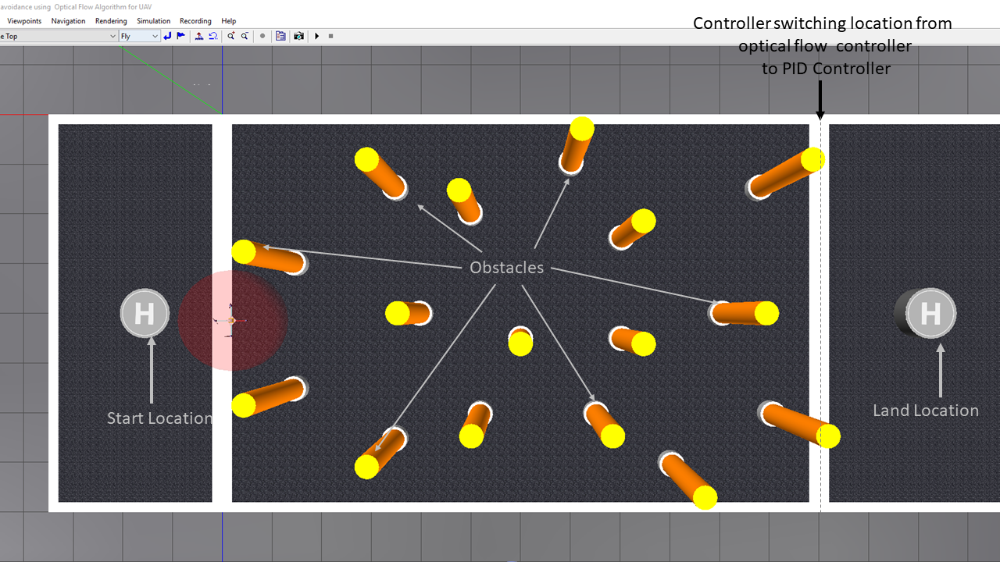
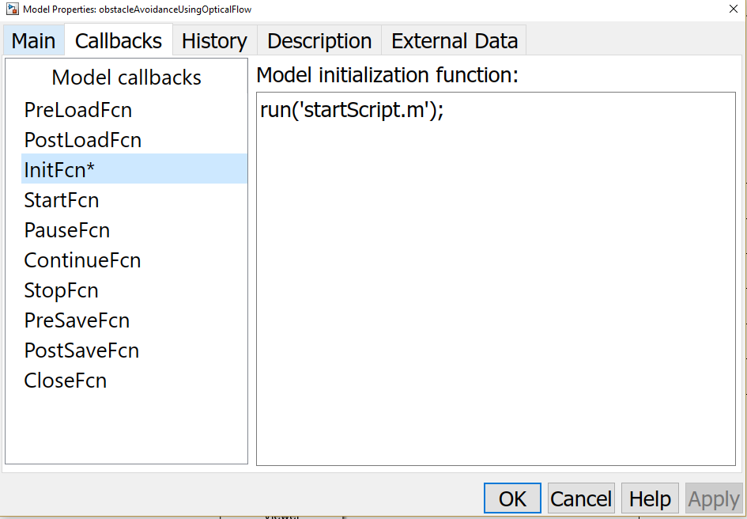
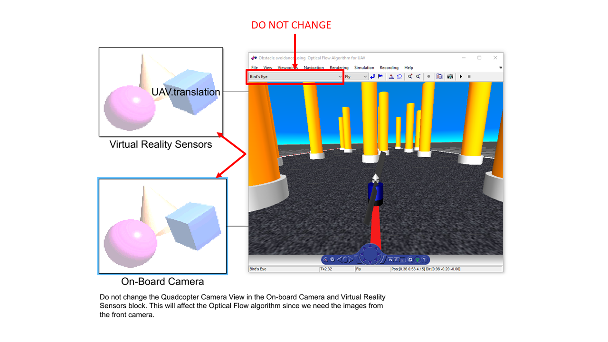
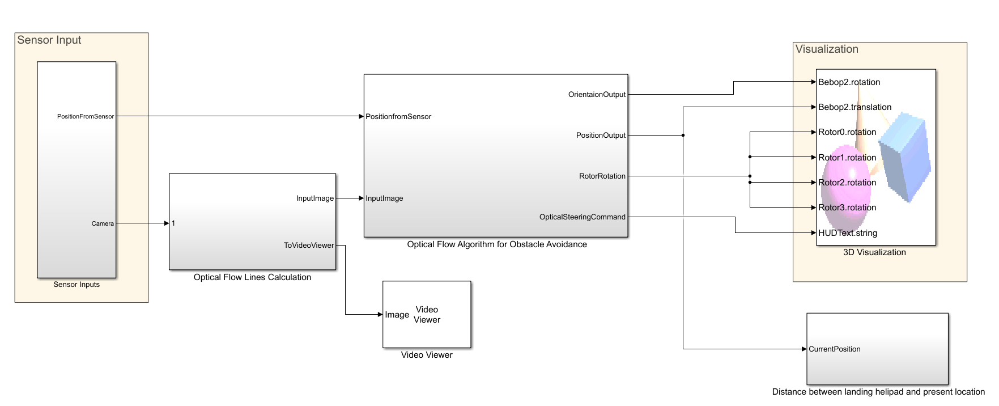
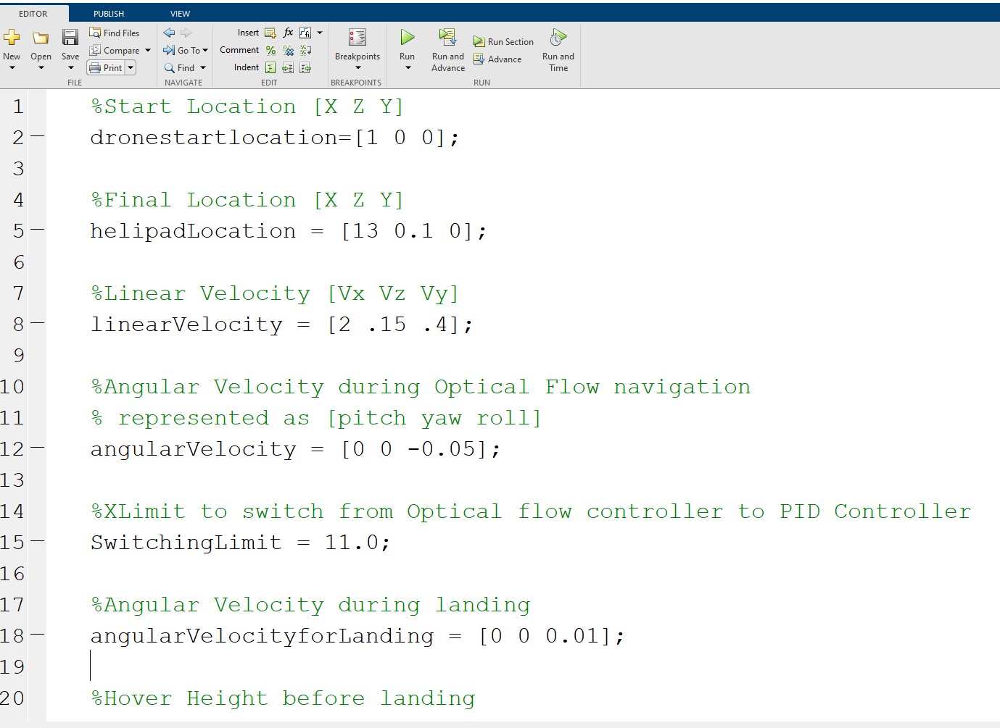

# Obstacle Avoidance with Camera Sensor using Simulink

This submission contains the implementation of [optical flow algorithm](https://www.mathworks.com/help/vision/ref/opticalflow.html) for obstacle avoidance. Here, the drone to traverses through a [Simulink&reg; 3D Animation](https://www.mathworks.com/products/3d-animation.html) arena using optical flow algorithm calculated using the drone's front view camera.
This model aims at helping you to get started to use computer vision along with control systems in your ground/aerial robots.
Using this model, you can get your UAV/UGV to avoid obstacles using the front-facing (bird's eye view) vision data of the vehicle.

Check out the video explaining this example:
[https://www.youtube.com/watch?v=YTmq13xGnLg](https://www.youtube.com/watch?v=YTmq13xGnLg)

## About the model ##

The model shows the workflow to implement an optical flow algorithm for navigating a drone through the arena which has poles as the obstacles. 

The following steps describe the workflow:

1. Getting the input image from the on-board camera.
2. Calculating the optical flow lines from the image using *Horn-Schunck* method
3. Implementing an algorithm for steering the vehicle from the calculated flow lines 
4. Implementing a switching based logic using [Stateflow&reg; ](https://www.mathworks.com/products/stateflow.html) to switch from optical flow algorithm to a PID Control algorithm.
5. Visualizing the drone navigating the obstacles through the VR Sink block (used to set the UAV position/rotation and visual properties of virtual world objects) associated with the virtual world.

When you open the model and execute it, the drone will take off from the helipad, navigate by evading the obstacles, switch to PID Controller once it detects that it is close to the landing area and eventually, land on the landing helipad. 

## Model ##

**obstacleAvoidanceUsingOpticalFlow.slx** contains a model which implements Optical Flow algorithm for navigating through obstacles and PID Control algorithm for Drone Landing.

**startScript.mlx** contains the constants used in the model.

**virtualworld** folder contains the files required for showing the quadcopter in the Simulink 3D Animation World

**uav_environment.wrl** shows the three-dimensional environment used for the simulation. 

*Note:* Before running the model, please make sure all these files are in the current folder

## How to run the model? ##
- Open the Simulink model *obstacleAvoidanceUsingOpticalFlow.slx*. 

- The model automatically adds the *virtualworld* folder to the path. Check *PostLoadFcn* [Model Callback](https://www.mathworks.com/help/simulink/ug/model-callbacks.html). 

- The model automatically loads *startScript.m* that initializes the parameters required to run the model.Check *InitFcn* [Model Callback](https://www.mathworks.com/help/simulink/ug/model-callbacks.html). 

 

- Run the model.

## Assumptions in the model ##

- While designing the system, the drone is considered as a point mass and the drone dynamics are not considered.
- The feedback from the drone is taken from the Simulink 3D Animation sensors.
- The model assumes that the user knows at what point the controller switches from using optical flow to using PID controller.
- The model also assumes that the x-coordinate landing location is greater than the x-coordinate of the point of transition from optical flow controller to PID Controlelr.

*Note:* Do not change the *Bird's Eye* View in the *On-board Camera* and *Virtual Reality Sensors* block. This will affect the optical flow algorithm since we need the images from the front camera.

## About the Subsystems ##

- *Sensor Inputs:* Simulink 3D Animation Sensor inputs (camera view and estimated position)
- *Optical Flow Lines Calculation:* Calculates the optical flow lines for the image using 'Horn-Schunk' method.
- *Optical Flow Algorithm for Obstacle Avoidance:* Controller for steering the vehicle: 
    - *FlowDifferences* MATLAB&reg; Function: The Optical Flow on the right and left is calculated by the system. 
    - *Optical flow algorithm and PID Controller for landing:*
        - *DronePositionEstimation:*
            1. *OpticalFlowAlgorithm:* The sign of the linear velocity (*V_Y*)is assigned depending on Optical Flow on Left and Right
            2. *ControlAlgorithm:* Switch to the PID controller to hover above the destination coordinate.
            3. *DroneLanding:* Descend the drone to the floor.
        - *DroneOrientationEstimation:* 
            1. *OpticalFlowAlgorithm:* The sign of the angular velocity (*W_Y*)is assigned depending on Optical Flow on Left and Right
            2. *ControlAlgorithm:* Find the orientation from angular velocities
- *3D Visualization:* Once the Position and Orientation outputs are estimated in the model, they are sent to the VR Sink block which are then used to set the UAV position / rotation. 
- *Distance between landing helipad and present location:* This subsystem calculates the distance between the current point and the Helipad Lcoation. If the drone gets closer to the helipad, it stops the simulation. The propeller will be turned off since the sensor at the landing helipad will get activated.

## How to change the start location, land location and other parameters? ##
All the variables used in the model are lcoated in the *startScript.m* file. To change any of the paramters, change the variable value in the file. You can *Run* the file to ensure that the variables are updated.

- *droneStartLocation*: The location from where the drone will take off.
- *helipadLocation*: The location where the drone will land. Presently this is assigned as the center ocation of the helipad. This can be modified to a value where the drone needs to land.
- *linearVelocity*: The linear velocity [V_X V_Z V_Y] during optical flow navigation.
- *angularVelocity*: The angular velocity [W_X W_Z W_Y] during optical flow navigation.
- *angularVelocityforLanding*: The angular velocity of the drone during landing.
- *switchingXLimit*: The X-coordinate to switch from Optical flow controller to PID Controller
- *finalHoverHeight*: The height to reach over the helipad before landing.
- *delta*: The threshold distance to execute the PID controller. The drone will start landing if the present coordinate of the drone is within this *delta* value.

## How to tune linear and angular velocities? ##

The linear and angular velocities defined in *startScript.mlx* need to tuned if the Simulink 3D Animation environment is modified.  The following are the steps to tune the same:
1. Ensure that with a given linear velocity, the drone doesn't move out of the arena. 
2. *V_Y* is the velocity which will be determined depending on the output from the optical flow algorithm. Here, the magnitude of V_Y remains the same but just the sign is changed. If:
	- *vleftflow* > *vrightflow*, then *V_Y* is positive. Hence, the drone will steer to its right.
	- *vrightflow* > *vleftflow*, then *V_Y* is negative. Hence, the drone will steer to its left.  
3. Similarly, the angular velocity *W_Y* will be determined depending on the output from the optical flow algorithm. Here, the magnitude of W_Y remains the same but just the sign is changed.If:
	- *vleftflow* > *vrightflow* then *W_Y* is negative (clockwise)
	- *vrightflow* > *vleftflow* then *W_Y* is positive (anti-clockwise)
4. If the drone was not be able to bypass all the obstacles with the given *V_Y*, change *V_Y* along with some incremental change in roll velocity. 
5. Always try with a smaller angular velocity values to ensure less oscillations since the decisions are made depending on the flow differences.For example, if there are lots of obstacles on both the sides of the drone, the sign of *flowDifference* will flip rapidly. In case the angular velocities are high here, the drone will have too many oscillations which are not desirable.

*Note*: The first component in linear velocity is the *V_X*, the second component in linear velocity is the *V_Z*, the third component in linear velocity is the *V_Y*.

## Product Requirements ##

The model use the following MathWorks products:

1. MATLAB
2. Simulink&reg;
3. Simulink 3D Animation
4. Stateflow
5. Aerospace Blockset&trade;
7. Aerospace Toolbox
8. Computer Vision Toolbox&trade;

In case of any questions, please reach out to us at roboticsarena@mathworks.com.

Copyright 2021 The MathWorks, Inc.

